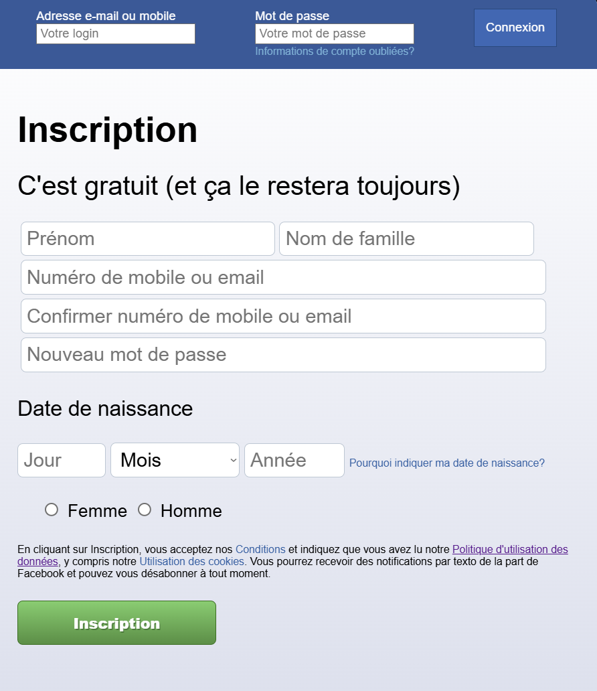

# Test-Uballers

## Précisions

Une estimation du temps que j'ai passé sur chaque langage:
- **HTML** : 50-60%
- **PHP** : 10-20%
- **CSS** : 30-40% 

## Comment exécuter la page?

Afin d'exécuter la page en local, il y a plusieurs cas de figures:
- Si vous utilisez **Laragon** ou **WampServer**, placez le dossier contenant le projet dans le dossier `/www` de l'emplacement d'installation de Laragon/WampServer. Exemple: `C:\laragon\www\UballersTest`, ou `C:\wamp\www\UballersTest`.
- Si vous utilisez **XAMPP**, placez le dossier contenant le projet dans le dossier `/htdocs` de l'emplacement d'installation de XAMPP.

Ensuite, démarrez le serveur local sur Laragon/WampServer/XAMPP, et rendez-vous dans votre navigateur avec l'URL `http://localhost/UballersTest`.

## Un aperçu

